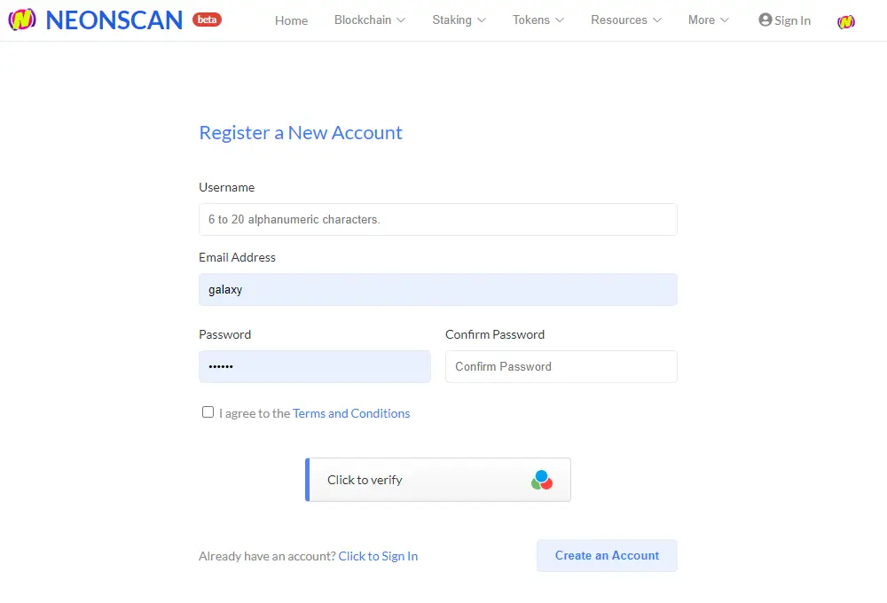
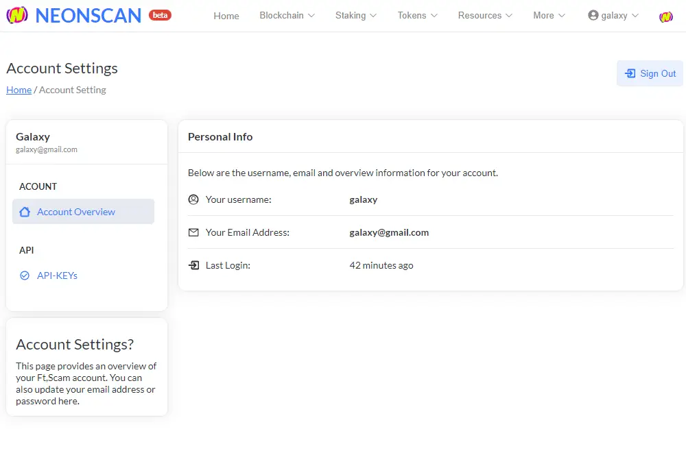

# Creating an Account

Having an NeonScan account allows you to use sign-in only features and tools such as Address Watch List, Txn Private Notes, Token Ignore List and your very own API keys 🗝.

> Note that creating an NeonScan account is only linked to NeonScan's block explorer services, it is not the same as creating a ​💡.

## 1. Register an Account
Head over to the  page and provide a username, email and password for your account.

---

## 2. Using Your Account

Upon signing in, you will have access to your **account dashboard** where you can make full use of NeonScan's features such as generating API keys 🗝, hide unwanted tokens and add private notes.

