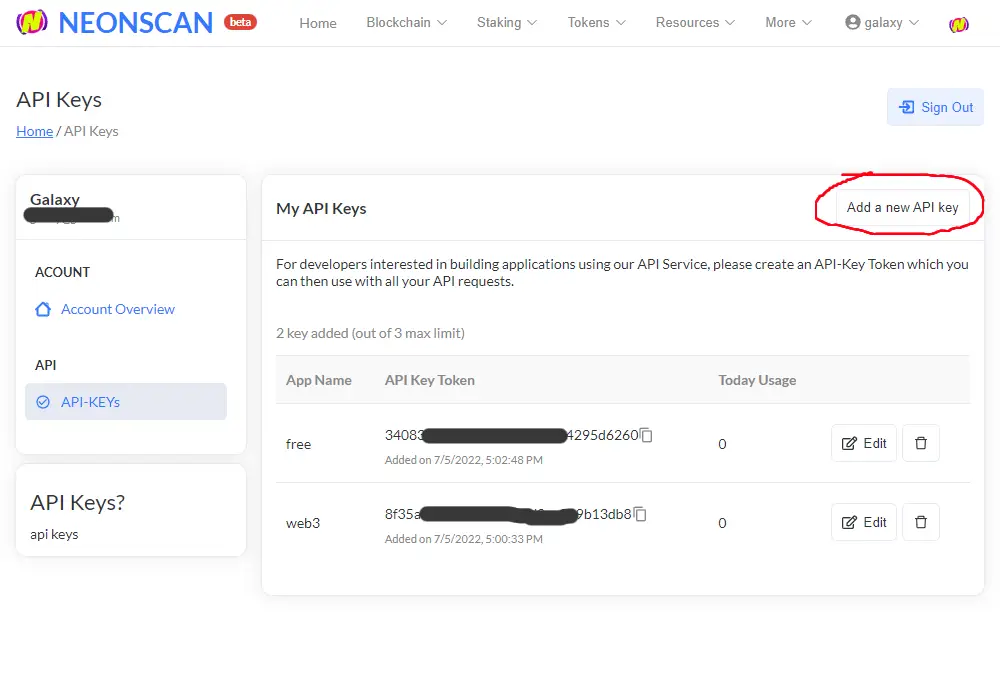
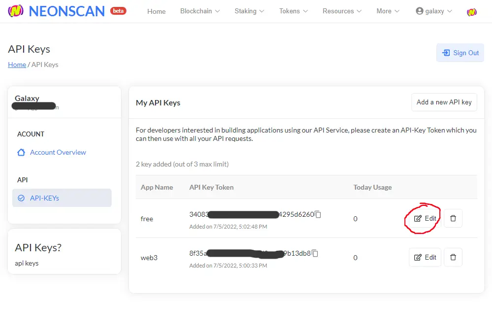
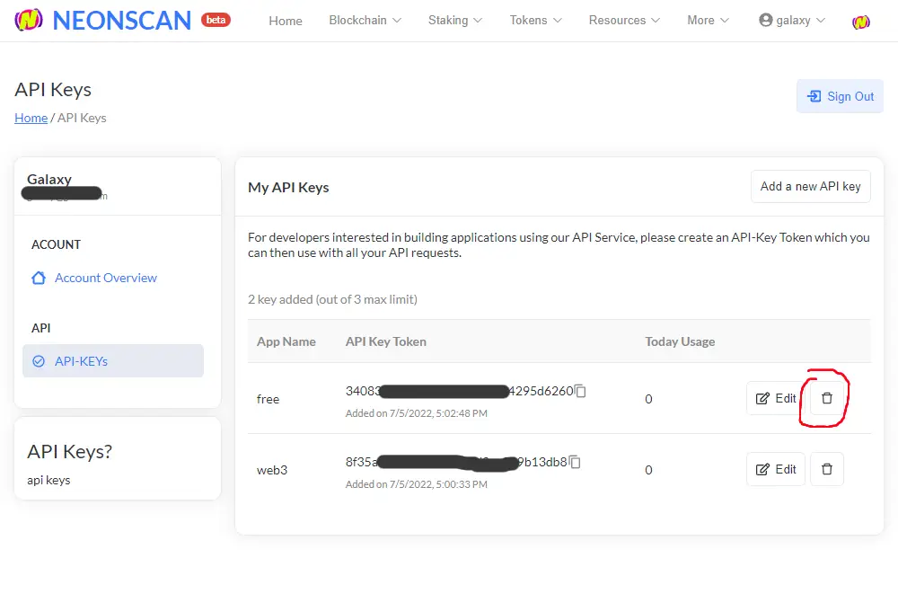

# Getting an API Key

> API keys created from your account dashboard can be used for both and  explorers 🏗.

## Creating an API Key
From your [Account Dashboard](/myaccount), click on the navigation tab labelled 🗝 API-KEYs.

From there, you may click on **Add** to create a new key and give a name to your project. Each NeonScan account is limited to creating **3 keys** at any one time.

## Editing an API Key
To change your **project name** associated with an API Key, click on **Edit** to specify a new App Name, and save the changes.

If you would like to **delete an API Key** or suspect your key has been compromised, you may click on **Remove** to delete that key and generate a new one.

